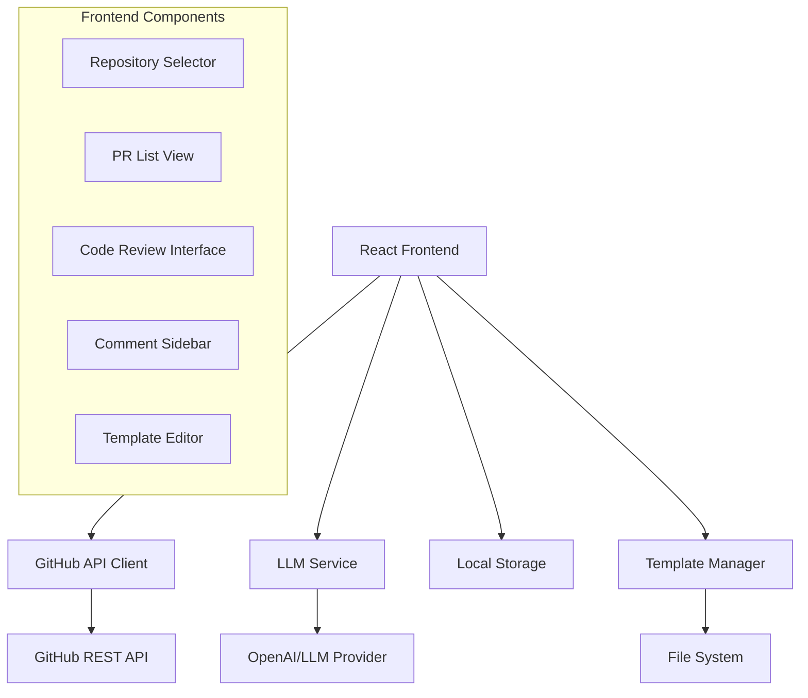

# Design Document

## Overview

The GitHub PR Review UI is a web-based application that integrates with the GitHub API to provide automated code review capabilities using LLM analysis. The system follows a multi-step workflow: repository selection → PR listing → code review execution → comment management → export/submission.

The application will be built as a single-page application (SPA) using React with TypeScript for type safety and maintainability. The architecture emphasizes modularity, clear separation of concerns, and responsive design principles.

## Architecture

### High-Level Architecture



### Technology Stack

- **Frontend Framework**: React 18 with TypeScript
- **State Management**: React Context + useReducer for complex state
- **Styling**: Tailwind CSS for rapid UI development
- **HTTP Client**: Axios for API requests
- **Code Highlighting**: Prism.js or Monaco Editor for syntax highlighting
- **GitHub Integration**: GitHub REST API v4
- **LLM Integration**: OpenAI API (configurable for other providers)

## Components and Interfaces

### Core Components

#### 1. App Component
- Root component managing global state and routing
- Handles authentication state and error boundaries
- Provides context providers for shared state

#### 2. Repository Selector (`RepoSelector`)
```typescript
interface Repository {
  id: number;
  name: string;
  full_name: string;
  owner: {
    login: string;
    avatar_url: string;
  };
  private: boolean;
}

interface RepoSelectorProps {
  onRepoSelect: (repo: Repository) => void;
  loading: boolean;
}
```

#### 3. Pull Request List (`PRList`)
```typescript
interface PullRequest {
  id: number;
  number: number;
  title: string;
  user: {
    login: string;
    avatar_url: string;
  };
  created_at: string;
  updated_at: string;
  head: {
    sha: string;
    ref: string;
  };
  base: {
    sha: string;
    ref: string;
  };
}

interface PRListProps {
  repository: Repository;
  onPRSelect: (pr: PullRequest) => void;
}
```

#### 4. Code Review Interface (`CodeReviewInterface`)
```typescript
interface ReviewComment {
  id: string;
  file: string;
  line: number;
  content: string;
  severity: 'info' | 'warning' | 'error';
  status: 'pending' | 'accepted' | 'rejected';
  isEditing?: boolean;
}

interface CodeReviewInterfaceProps {
  pullRequest: PullRequest;
  repository: Repository;
}
```

#### 5. Comment Sidebar (`CommentSidebar`)
```typescript
interface CommentSidebarProps {
  comments: ReviewComment[];
  onCommentAccept: (commentId: string) => void;
  onCommentEdit: (commentId: string, newContent: string) => void;
  onCommentDelete: (commentId: string) => void;
  onCommentClick: (commentId: string) => void;
}
```

### Service Interfaces

#### GitHub API Service
```typescript
interface GitHubService {
  authenticate(token: string): Promise<void>;
  getRepositories(): Promise<Repository[]>;
  getPullRequests(repo: string): Promise<PullRequest[]>;
  getPullRequestDiff(repo: string, prNumber: number): Promise<string>;
  postReviewComments(repo: string, prNumber: number, comments: ReviewComment[]): Promise<void>;
}
```

#### LLM Service
```typescript
interface LLMService {
  analyzeCode(diff: string, template: string): Promise<ReviewComment[]>;
  configure(apiKey: string, model: string): void;
}
```

#### Template Service
```typescript
interface ReviewTemplate {
  name: string;
  content: string;
  criteria: string[];
}

interface TemplateService {
  loadTemplate(name: string): Promise<ReviewTemplate>;
  saveTemplate(template: ReviewTemplate): Promise<void>;
  listTemplates(): Promise<string[]>;
}
```

## Data Models

### Application State
```typescript
interface AppState {
  auth: {
    isAuthenticated: boolean;
    token: string | null;
    user: GitHubUser | null;
  };
  repositories: Repository[];
  selectedRepository: Repository | null;
  pullRequests: PullRequest[];
  selectedPR: PullRequest | null;
  reviewComments: ReviewComment[];
  templates: ReviewTemplate[];
  ui: {
    loading: boolean;
    error: string | null;
    currentView: 'repos' | 'prs' | 'review';
  };
}
```

### Review Template Structure
```typescript
interface ReviewTemplate {
  name: string;
  description: string;
  prompts: {
    codeQuality: string;
    security: string;
    performance: string;
    maintainability: string;
    testing: string;
  };
  rules: {
    maxComplexity: number;
    requireTests: boolean;
    securityChecks: string[];
  };
}
```

## Error Handling

### Error Types
1. **Authentication Errors**: Invalid GitHub tokens, expired sessions
2. **API Errors**: Rate limiting, network failures, invalid repositories
3. **LLM Errors**: API failures, quota exceeded, invalid responses
4. **Template Errors**: Invalid markdown, missing files, parsing failures

### Error Handling Strategy
- Global error boundary for unhandled React errors
- Service-level error handling with retry mechanisms
- User-friendly error messages with actionable suggestions
- Graceful degradation when services are unavailable

### Error Recovery
```typescript
interface ErrorHandler {
  handleAuthError(error: AuthError): void;
  handleAPIError(error: APIError): Promise<void>;
  handleLLMError(error: LLMError): void;
  retryOperation<T>(operation: () => Promise<T>, maxRetries: number): Promise<T>;
}
```

## Testing Strategy

### Unit Testing
- **Components**: React Testing Library for component behavior
- **Services**: Jest mocks for API interactions
- **Utilities**: Pure function testing for data transformations
- **Hooks**: Custom hook testing with React Hooks Testing Library

### Integration Testing
- **API Integration**: Mock GitHub API responses
- **LLM Integration**: Mock LLM service responses
- **Template System**: File system operations testing

### End-to-End Testing
- **User Workflows**: Cypress for complete user journeys
- **Authentication Flow**: GitHub OAuth simulation
- **Review Process**: Complete PR review workflow testing

### Test Coverage Goals
- Minimum 80% code coverage
- 100% coverage for critical paths (authentication, API calls)
- Visual regression testing for UI components

## Security Considerations

### Authentication & Authorization
- GitHub Personal Access Tokens (PAT) for API access
- Secure token storage (encrypted local storage)
- Token validation and refresh mechanisms
- Scope-limited permissions (read repositories, write PR comments)

### Data Protection
- No persistent storage of sensitive code content
- Client-side encryption for stored tokens
- Secure transmission (HTTPS only)
- Rate limiting compliance with GitHub API

### LLM Security
- Input sanitization for code diffs
- Output validation for generated comments
- API key protection and rotation
- Content filtering for sensitive information

## Performance Optimization

### Frontend Performance
- Code splitting by route/feature
- Lazy loading of heavy components
- Virtual scrolling for large PR lists
- Debounced search and filtering
- Memoization of expensive computations

### API Optimization
- Request caching with appropriate TTL
- Batch operations where possible
- Pagination for large datasets
- Optimistic updates for user interactions

### LLM Optimization
- Diff chunking for large PRs
- Parallel processing of multiple files
- Response caching for similar code patterns
- Streaming responses for real-time feedback